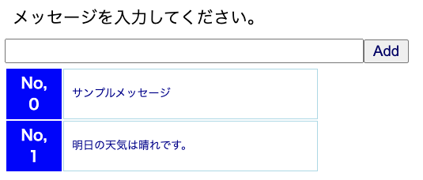
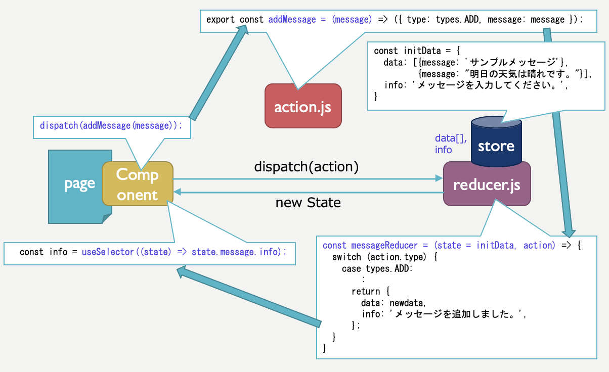

# next-redux1

React.js + Redux.js + Next.jsにおける、ReducerとAction Creatorのサンプルです。<br>
Formから入力したメッセージをReduxのストアで保管し、ストアのデータをリアルタイムに表示します。<br>




## インストール・実行手順
(1)next-redux2を起動
```
$ git clone https://github.com/lychee3/next-redux1.git
$ cd next-redux1
$ npm install
$ npm run dev
```

## ポイント

npx create-next-app --example with-redux-thunk next-app の雛形を改造します。
AddFormコンポーネントとMemoコンポーネントで共有するデータ（今回は入力したメッセージの配列）をReduxのストアで管理するよう、reducers.jsやactions.jsを編集します。<br>



reducers.js

```javascript:reducers.js
import { combineReducers } from 'redux'
import * as types from './types'

export const initMessageData = {
  data: [{message: 'サンプルメッセージ'}, {message: '明日の天気は晴れです。'}],
  info: 'メッセージを入力してください。',
}

const messageReducer = (state = initMessageData, action) => {
  switch (action.type) {
    case types.ADD:
      let newdata = state.data.slice();
      newdata.unshift({message: action.message});
      return {
        data: newdata,
        info: 'メッセージを追加しました。',
      };
    default:
      return state;
  }  
}

// COMBINED REDUCERS
const reducers = {
  message: messageReducer,
}

export default combineReducers(reducers)
```

actions.js

```javascript:actions.js
import * as types from './types'

export const addMessage = (message) => ({ type: types.ADD, message: message });
```