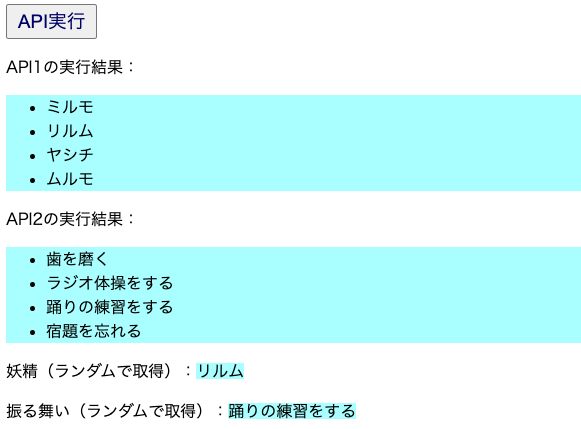

# next-redux2

React.js + Redux.js + Next.jsにおける、REST-API実行のサンプルです。<br>
API実行ボタンを押すと、2種類のAPIの実行結果を出力します。



## インストール・実行手順
(1)APIサーバの作成

「k8s-web3」リポジトリに含まれるsv1とsv2のPodを起動する。<br>
詳細手順はk8s-web3のREADMEを参照。

(2)next-redux2を起動
```
$ git clone https://github.com/lychee3/next-redux2.git
$ cd next-redux2
$ npm install
$ npm run dev
```

## ポイント

ブラウザは同一オリジンポリシーが導入されているため、異なるオリジンへのREST-API呼び出しを行うとCORS (Cross-Origin Resource Sharing, クロスオリジンリソース共有) エラーとなり、アクセスは遮断されてしまいます。<br>
CORSエラーが出ないようにするには、カスタムサーバ(server.js)を作成し、任意のリクエストをプロキシさせます。<br>

```javascript:server.js
app.prepare().then(() => {
  const server = express();

  server.use(
    '/api/fairies',
    createProxyMiddleware({
      target: 'http://localhost:8082',
      changeOrigin: true
    })
  );

  server.use(
    '/api/themes',
    createProxyMiddleware({
      target: 'http://localhost:8084',
      changeOrigin: true
    })
  );

  server.all('*', (req, res) => {
    return handle(req, res)
  });

  server.listen(port, err => {
    if (err) throw err
    console.log(`> Ready on http://localhost:${port}`)
  });
});
```

上記の例の場合、server.jsが代理で以下を呼び出します。
* /api/fairies ⇒ http://localhost:8082
* /api/themes ⇒ http://localhost:8084

REST-APIの実行側（View.js）は以下のように記述します。<br>
例として、axiosを使用してGET要求を行っています。

```javascript:View.js
  // API実行ボタンを押すと呼ばれる
  const handleSubmit = (event) => {
    event.preventDefault();
    setFairy("");
    setBehavior("");
    axios.get('/api/fairies/')
    .then(res => {
      setResult1(res.data.map((value, n) => ( <li key={n}>{value.name}</li> )));
      // 取得した配列からランダムで値を取り出す
      setFairy(res.data[Math.floor(Math.random() * res.data.length)].name);
    }) 
    .catch(err => alert(err));

    axios.get('/api/themes/')
    .then(res => {
      setResult2(res.data.map((value, n) => ( <li key={n}>{value.behavior}</li> )));
      // 取得した配列からランダムで値を取り出す
      setBehavior(res.data[Math.floor(Math.random() * res.data.length)].behavior);
    }) 
    .catch(err => alert(err));
  };
```

なお、カスタムサーバを利用してサーバ起動するので package.json は以下のように修正する必要があります。

```javascript:package.json
  "scripts": {
    "dev": "node server.js",
    "build": "next build",
    "start": "NODE_ENV=production node server.js"
  },
```

参考：https://laptrinhx.com/next-js-react-denocorsera-jie-jue-next-js-golang-3865916990/


以下はテストプログラム例です。<br>
APIサーバがいなくてもテスト実行できるよう、axios-mock-adapterを用いてAPIサーバをモック化しています。

```javascript:ViewTest.js
import { fireEvent, render, screen } from "@testing-library/react";
import "@testing-library/jest-dom/extend-expect";
import View from "../components/View";
import MockAdapter from "axios-mock-adapter";
import axios from 'axios';

const mockAxios = new MockAdapter(axios);
mockAxios.onGet('/api/fairies/').reply(200, 
  [{ id: 1, name: "ミルモ", instrument: "マラカス", sweets: "チョコレート" }],
);
mockAxios.onGet('/api/themes/').reply(200, 
  [{ id: 1, behavior: "歯を磨く" }],
  [{ id: 2, behavior: "ラジオ体操をする" }],
);

// View Componentのテスト
describe('View', () => {

  it('オブジェクト表示のテスト', () => {
    render(<View />);

    expect(screen.getByText(/API1の実行結果/)).toBeInTheDocument();
    expect(screen.getByRole('button', {name: "API実行"})).toBeInTheDocument();
  });

  it('API実行結果のテスト', async () => {
    render(<View />);

    // API実行前
    expect(screen.queryByText('ミルモ')).toBeNull();

    // API実行後
    const button = screen.getByText('API実行');
    fireEvent.click(button);
    await screen.findAllByText(/ミルモ/);
  });
});
```
